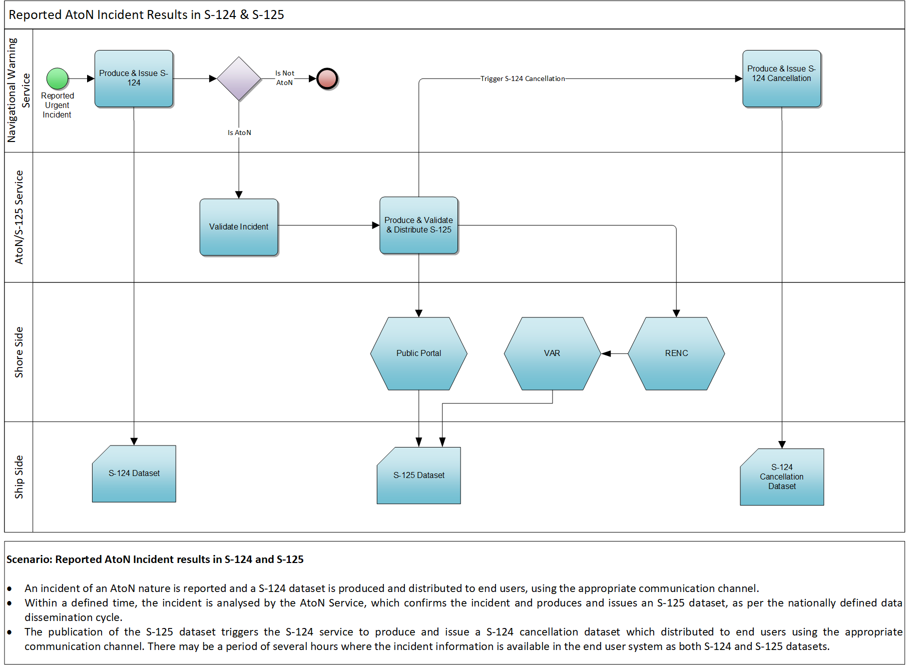

# Business Process Model {#sec:business_process}

[@fig:business_process_in_encs] depicts the general business process model for updating the AtoN information on ENCs, as it is expected to take place after the introduction of S-201 and S-125. The introduction of the MS-2 - Aids to Navigation Service intends to automate the collection AtoN updates and delivery to the service consumer, whether that is a HO, a shore-side entity (such as a public portal, a RECN, a VAR or an OEM), or a ship-side seafarer.

{#fig:business_process_in_encs}

In the diagram of [@fig:business_process_in_encs], the “Validation Operation” task of the HO, relates to the data conformity against the respective data product specifications, not validation of the data content itself. The accuracy of the data is the responsibility of the competent AtoN Authority, of course within the limits of the operational constraints. Additional tests for the cross-validation between the involved data products is also required by the HO or the RENC, to ensure that all data product datasets published are compatible and do not provide conflicting information.

{#fig:business_process_s124_s125}

[@fig:business_process_in_encs] also captures cases where the AtoN incident reported is considered as urgent by the AtoN Authority. The business process thatis followed in those cases, is further described in [@fig:business_process_s124]. As depicted, the promulgation of a Navigational Warning through S-124 is mandated, thus the incident is reported and initially handled by the Navigational Warning Service. After a new S-124 dataset has been produced and promulgated, the incident can be further analysed by the AtoN Service for the timely update of its S-125 datasets. In accordance with the IMO documentation [@cite:imo-msc-1-circ1610-rev1-2024], both the Navigational Warning and AtoN Services are expected to be digital techical services. The operational structure and responsibility for these digital services should be determined by the competent authorities of the respective coastal states (e.g. Coastal Authority, HO, AtoN Authority etc.), in accordance with their national policies and regulations.