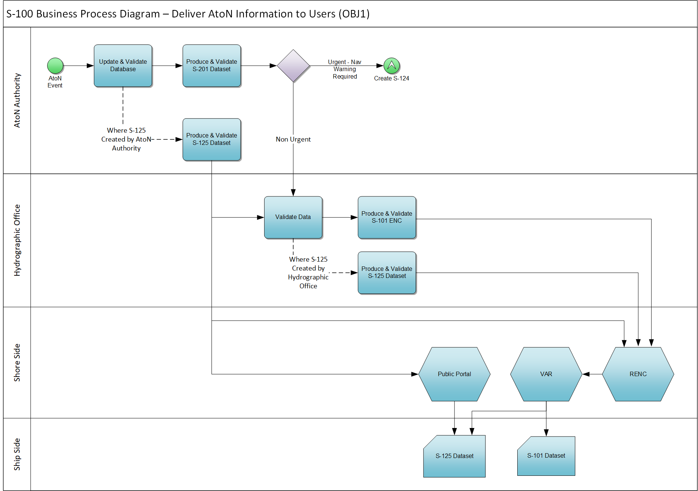

# Business Process Model {#sec:business_process}

[@fig:business_process_in_encs] depicts the general business process model for updating the AtoN information on ENCs, as it is expected to tak eplace after the introduction of S-201 and S-125. The MS-2 - Aids to Navigation Service aims to automate the collection AtoN updates and delivery to the service consumer, whether that is a HO, a shore-side entity (such as a public portal, a RECN, a VAR or an OEM) or a ship-side mariner.

{#fig:business_process_in_encs}

In the [@fig:business_process_in_encs] diagram, the “Validation Operation” task of the HO, relates to the data conformity against the respective data producy specification, not validation of the data content itself. This is required by the AtoN Authority responsible for the data accuracy. In addition, cross-validation between products is required by the HO, the RENC, to make sure that all data product datasets published are compatible and agree with each other.

In terms of the relationships between S-201, S-125 and S-124 the following process has been identified: 

1. An incident of an AtoN nature is reported and a S-124 dataset (S1) is produced and distributed to end users, using the appropriate communication channel.

2. Within a defined time, e.g.same day, the incident is analysed by the AtoN Service through the F1 feedback loop, which confirms the incident and generates an S-125 dataset (S2) which is issued the next day, as per the nationally defined data dissemination cycle, and then received by the end user system.

3. The publication of the S-125 dataset triggers the S-124 service via the F1 feedback loop to issue a S-124 cancellation dataset (S3) which is received by the end user system. There may be a period of several hours where the incident information is available in the end user system as both S-124 and S-125 datasets, but fine tuning the F1 feedback look can virtually eliminate this duplication.