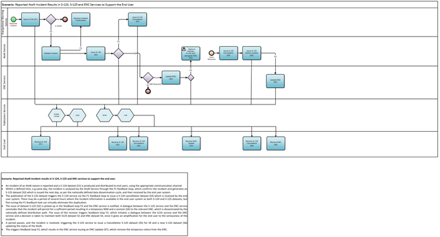

# Business Process Model {#sec:business_process}

[@fig:business_process_in_encs] on the left depicts the general business process for the update of AtoN information on ENC’s as it is in the current situation. The AtoN information service aims to automate the collection AtoN updates and delivery to the service consumer this is depicted on the right side of the figure.

{#fig:business_process_in_encs}

{#fig:business_process_operational_context}