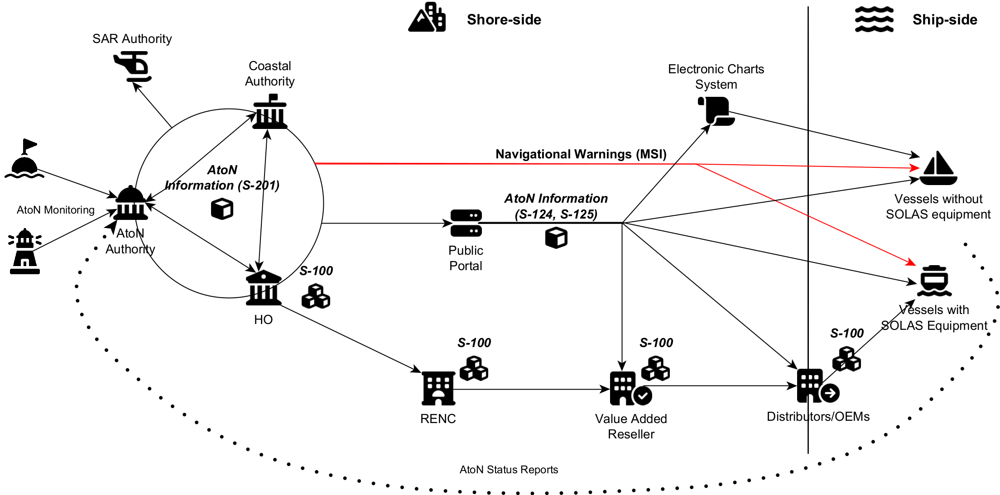

# Introduction {#sec:introduction}
 
The maritime domain is facing a number for challenges, mainly due to the increasing demand, that may increase the risk of an accident or loss of life. These challenges require technological solutions and e-Navigation, as a concept, is one such solution. The International Maritime Organization (IMO) in 2010, adopted a strategy for the development and implementation of this concept (MSC.85/26/Add.1 Annexes 20 [@cite:imo-msc-85-26-add1-annex20-2010] and 21 [@cite:imo-msc-85-26-add1-annex21-2010]), which eventually resulted in the adoption of the MSC.1/Circ.1595 Strategy Implementation Plan (SIP) [@cite:imo-msc-1-circ1595-2018]. In that document e‐Navigation is defined as:

“…the harmonized collection, integration, exchange, presentation and analysis of maritime information on-board and ashore by electronic means to enhance berth-to-berth navigation and related services, for safety and security at sea and protection of the marine environment.”

The IMO SIP outlines 5 key solutions as the basis for accomplishing the e-Navigation vision:

* S1: improved, harmonized and user-friendly bridge design.

* S2: means for standardized and automated reporting.

* S3: improved reliability, resilience and integrity of bridge equipment and navigation information.

* S4: integration and presentation of available information in graphical displays received via communication equipment.

* S5: improved communication of VTS Service Portfolio (not limited to VTS stations).

As part of the improved provision of services to vessels through e-Navigation, Maritime Services (MSs) have been identified as the means of providing electronic information in a harmonized way, which is part of solution S5.

Under MSC.1/Circ.1610 [@cite:imo-msc-1-circ1610-2019], as amended [@cite:imo-msc-1-circ1610-rev1-2024] per IALA input, the IMO provides a set of descriptions of the identified MSs, to ensure that their future implementation is done internationally in a standardized and harmonized format. The MS-2 ¬– Aids to Navigation Service was introduced, with the aim of promulgating the latest information on AtoN and augment charted AtoN information on an appropriate shipborne navigation display prior to updates to the nautical chart. 
IALA as the organisation responsible for the harmonization and standardisation of the provision of Aids to Navigation (AtoNs), is the most well-positioned international body to provide a more detailed description of the context of the MS-2 – Aids to Navigation Service and offer guidance the high-level considerations of how it should be implemented. To do so, the IALA G-1155 [6] guideline template is utilised, as this was specifically defined to support the IALA members on the specification process of MS.

## Purpose of this Guideline {#sec:introduction_purpose}

The purpose of this document is to provide a holistic overview of the MS-2 – Aids to Navigation Service and its building blocks in a technology-independent way.  The aim is to outline the e-Navigation context of the service, establish the captured user needs which justify a business case for it, and finally support the service architects in creating a description on the involved technical services at a high level of abstraction, by providing the key aspects of the service at the logical level:

* Context and goal of the service.

* Relations to other services.

* User needs, information needs, high level functional and non‐functional requirements.

* Requirements traceability matrix.

* Business architecture with a Business Process Model (BPM).

## Context of the Maritime Service {#sec:introduction_context}

As specified in [@cite:imo-msc-1-circ1610-rev1-2024], the MS-2 – Aids to Navigation Service describes the provision of AtoN deployed to enhance the safety of navigation. AIS Application Specific Messages (AIS-ASM) are not included in the description of the MS.

IALA defines an AtoN as any device, system or service, external to vessels, designed and operated to enhance the safe and efficient navigation of individual vessels and/or vessel traffic. The IMO definition of the MS-2 – Aids to Navigation Service includes any Positioning, Navigation and Timing (PNT) services, while Vessel Traffic Services (VTS) are considered separately in [@cite:imo-msc-1-circ1610-rev1-2024]. In the question of PNT, the physical AtoN infrastructure is seen as an integral part, as it cannot be spoofed or jammed. In addition, AtoN structures can be utilised to measure the integrity of PNT information. As such, PNT will be considered in this document as well.

### AtoN Information Flow {#sec:introduction_aton_info_flow}

This maritime service specification document describes the high-level flow of AtoN information between a service provider and the end-users of such a service. In most cases, the service provider is an AtoN Authority, while the end-users include both shoreside authorities/organisations and mariners, which may (or may not) need to display the data onto a type-approved Electronic Chart Display and Information System (ECDIS) or any other Electronic Chart System (ECS) in general. These relationships are illustrated in the information flow diagram of [@fig:aton-information-flow]. Please note that this diagram is just the representation of a typical envisioned environment, and other variations may also be established.

{#fig:aton-information-flow}

The diagram is divided into two main sections, illustrating how navigation data is distributed and utilized.

* The Shore-Side

* The Ship-Side

At the core, the AtoN Authority serves as the primary provider of AtoN information. This may be collected directly and/or indirectly, from all AtoN deployed and monitored in the AtoN authority’s area of responsibility. The AtoN Authority is in most cases in close collaboration (in several member states even joint) with the responsible Coastal Authority and the Hydrographic Office (HO) Authority. These three entities are required to continuously share AtoN information. This inter-authority data exchange is expected to take place using the IALA S-201 data product specification. The AtoN information is then disseminated to other key stakeholders such as Search and Rescue (SAR) Authorities, Regional Electronic Navigational Chart Coordination Centre (RENCs), and in some cases even maritime data Value Added Resellers (VARs). The primary data format used for all these interactions is expected to be in line with the IHO S-100 framework. The conformance requirement enhances the data quality and supports the interoperability of the communication mechanisms.

On the commercial and technical side, the AtoN information extends to Value-Added Resellers (VARS), as well as the Distributors and Original Equipment Manufacturers (OEMs), which are responsible for the distribution of navigational data and AtoN information to the end-users using equipment covered by SOLAS. This step includes the communication over the “last-mile”, as this is defined by the IEC 63173-2 (SECOM) [@cite:iec-63173-2]. standard. The design and implementation however of the “last-mile” solutions, is considered to be vendor-specific and outside the scope of this document.

Public Portal services could potentially act as another vital distribution point. They can be paid of free of charge services, which may offer access to the AtoN information through IHO S-125 data product specification. S-201 is not suggested for this operation as an unnecessarily large description with potential safety issues. The S 201 format is designed for different aspects of maritime navigation, and although it is technically supported by Electronic Chart Display and Information Systems (ECDIS), this is not currently the accepted standard method of distribution. Navigational Warning (NW) and other MSI-related information may also be shared using the NW IHO S-124 data product. The information flow through a coastal authority or a public portal, may further support the AtoN information dissemination to end-users without equipment covered by SOLAS, more specifically users of third-party Electronic Chart Systems (ECS). This flow can also complement the availability of AtoN information towards the OEMs if and when required.

On the ship-side, the processed and distributed AtoN information is intended to reach all end-users, including SOLAS vessels, non-SOLAS vessels. This ensures that all classes of maritime traffic, from large commercial ships to smaller recreational or non-SOLAS vessels, can reliably access the same navigational information, even if it has been packaged differently, or is distributed with a different update frequency. The harmonized data flow enhances maritime safety by ensuring that critical AtoNs, such as buoys, beacons, and lighthouses, are accurately represented in digital navigation systems. The MS-2 service also aspires to establish a standardized and trustworthy feedback loop for AtoN status reports. This would allow mariners to report AtoN outages and deviations from the advertised standards. Communication security and identity management become paramount in that use case, to ensure the reliability and integrity of the reported outages.

### Types Of Information {#sec:introduction_information_types}

As per the non-exhaustive list found in [@cite:imo-msc-1-circ1610-rev1-2024], user needs may include the most up-to-date presentation of information on:  

* New hazards (fixed or dynamic)

* Temporary channels or routes

* Temporary areas to be avoided (e.g. restricted areas, military exercises)

* Survey, dredging, fishing, special marine events)

* Changed hydrography, such as shifting banks

* Temporary replacement of a charted aid that is off station or removed

* Dynamic areas (e.g. reduced visibility, presence of protected species)

* Polar navigation, provided there is sufficient means of radio communication broadcast and charting

* Ice conditions and navigation

* Incident response (e.g. environmental, search and rescue)

* Port-specific applications (e.g. passage planning, amended pilot boarding location)

* Measures for the protection of the marine environment

* Security

* PNT information on position in real time (timing is a critical component in the provision of some AtoN services, and the need to synchronize and reference radionavigation signals to Universal Coordinated Time (UTC) will increase as look to use more diverse systems and solutions)

* PNT integrity (recognizing the vulnerability of radionavigation systems to interference (e.g. GNSS jamming); the use of multiple dissimilar positioning and timing systems is required to achieve resilience in support of safe navigation and the optimal working of AtoN)

This document also makes special mention to the following types:

* New construction areas (e.g. offshore wind farms)

### Associated Technical Services {#sec:introduction_assoc_services}

Once again, as per [@cite:imo-msc-1-circ1610-rev1-2024], the MS-2 – Aids to Navigation Service make use of the IHO S-100 framework relevant data product specifications (S-125, S-124, S-201 and S-240) and is comprised of a set of associated technical services, as shown in the following table:

| Name | ID (MRN) | Description | Standardization Body |
| --- | --- | --- | --- |
| Provision of AtoN Information Service to End Users |urn:mrn:iala:techsvc:ss:arm:atoninfo | Using the data model from the S-125 product specification | IALA (IHO) |
| Enhanced AtoN Information for AtoN Authorities | urn:mrn:iala:techsvc:ss:arm: enhancedatoninfo | Using the data model from the S-201 product specification | IALA |
| Navigational Warnings Service |	urn:mrn:iho:techsvc:ss:nwinfo | Using the data model from the S-124 product specification | IHO |
| PNT Information | urn:mrn:iala:techsvc:ss:arm:pntinfo | Using the data model from the S-240 product specification | IALA |

: MS-2 Associated Technical Services. {#tbl:assoc-tech-services}

## Objectives Of The Service {#sec:introduction_objectives}

This section provides information about the objective(s) of the MS-2 – Aids to Navigation Service.
These are not operational but rather conceptual. Therefore, they cannot be described directly into Specific, Measurable, Achievable, Realistic, and Timely (SMART) terms. A specific but high-level approach is followed, resulting in the following entries:

* **OBJ1**: Provision of AtoN information service to all end-users.

* **OBJ2**: Provision of AtoN information to other authorities.

* **OBJ3**: Describe physical, virtual and synthetic AtoN.

* **OBJ4**: Deliver the current status and changes of AtoN information.

* **OBJ5**: Supplement charts and nautical publications with accurate “high-quality” AtoN information.

* **OBJ6**: Support the adoption of MASS, supplying up-to-date machine readable AtoN information.

The **OBJ#** identifiers, provided for each of the stated objectives, should be used to reference the objective for each of the technical service requirement specifications.

## Intented Users Of The Service {#sec:introduction_intended_users}

Following the operational context and the AtoN information exchange diagram of [@fig:aton-information-flow], the following non-exhaustive user list is defined for the MS-2 – Aids to Navigation Service:

* Other AtoN authorities

* Coastal Authorities

* Hydrographic Offices

* Regional Electronic Navigational Chart Coordination Centers (RENCs)

* Value-Added Resellers (VARs) and Distributors

* Search & Rescue Services

* VTS Providers

* Other Electronic Chart System providers

* Automated systems for navigation of vessels in coastal and/or open waters.

* Mariners with or without SOLAS equipment navigating in coastal or open waters
