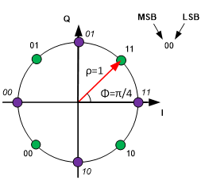

# What You'll Find Here

This document is designed to assist you in contributing to the draft description MS-2 – Aids to Navigation Service. It provides an overview of [our approach](#our-approach) to developing and maintaining documents, recommends editing [tools](#tools), and describes the [syntax](#markdown-syntax-overview) used. It also outlines the [recommended workflow](#recommended-workflow) for those looking to contribute.

# Our Approach

## Document Format

* We write our documents in [Markdown](#markdown-syntax-overview).

* Using plain text files simplifies collaboration and version control (at least in theory).

* Markdown offers a relatively lightweight syntax that supports cross-referencing, LaTeX-like maths, diagrams and more.

* It allows for automatic conversion to various document formats, including `.docx` and `.pdf`.

* A template is provided for generating `.docx` files in accordance with the [IALA Style Guide](https://www.iala-aism.org/product/iala-style-guide/).

## Version Control

* The source code is version-controlled using [Git/GitHub](#git-and-github).

* The `main` branch on GitHub serves as the *single source of truth*, eliminating potential confusion due to multiple versions of documents in circulation.

* Documents are available for preview on GitHub at any time.

* An updated Word document is automatically generated when new content is merged into the `main` branch.

## Contribution Process

* Contributors are invited to propose changes by submitting 'pull requests' on GitHub whenever they wish.

* Change proposals are reviewed and addressed during official [meetings of IALA DTEC WG3](https://www.iala-aism.org/product-category/calendar/).

* Contributions through GitHub are preferred for efficiency and traceability.

# Tools

## Git and GitHub

[Git](https://git-scm.com/) is a version control system that tracks changes in computer files. It is typically used via command line on a local machine.

A *repository* refers to a collection of files under Git version control.

[GitHub](https://github.com/) offers a web-based platform for hosting Git repositories. It provides a user-friendly graphical interface and collaboration tools.

While understanding Git is helpful for navigating GitHub, it's not necessary.

### GitHub Overview

For beginners, GitHub offers [guides](https://docs.github.com/en/get-started/start-your-journey) that cover the fundamentals of its use.

This project's GitHub repository is located at <https://github.com/gla-rad/iala_g_vdes_authentication> (remember to log into GitHub first; otherwise, you will receive a 404 error).

The repository is currently private, accessible only to invited contributors. If you are interested in contributing, please send your [GitHub](https://github.com/join) user name to <jan.safar@gla-rad.org> for access.

A [README](../../README.md) file located in the root directory offers an overview of the repository's structure.

Before you start modifying the repository, it's important to create a [new branch](https://docs.github.com/en/pull-requests/collaborating-with-pull-requests/proposing-changes-to-your-work-with-pull-requests/creating-and-deleting-branches-within-your-repository) from `main` with a descriptive name for your changes (e.g. `add-definitions`). **Direct changes to the `main` branch should be avoided.**
 
[Editing text files](https://docs.github.com/en/repositories/working-with-files/managing-files/editing-files) directly on GitHub is straightforward. Navigate to the file, click the pencil icon to edit, and commit your changes to your branch. Making small, frequent commits with clear messages is good practice.

When ready, submit a [pull request](https://docs.github.com/en/pull-requests/collaborating-with-pull-requests/proposing-changes-to-your-work-with-pull-requests/creating-a-pull-request) for review and merging into the `main` branch. Include an explanation of your proposed changes.

Your pull request(s) will be considered at the next IALA DTEC WG3 meeting.

### Git (Optional)

If you are comfortable with the command line, you can [install Git](https://git-scm.com/book/en/v2/Getting-Started-Installing-Git) and [clone the repository](https://docs.github.com/en/repositories/creating-and-managing-repositories/cloning-a-repository) to your local machine. This will allow you to work on your change proposals offline.

Remember to create a new branch for each proposal.

After editing locally, push your updates to your branch on GitHub.

Submit a pull request to the `main` branch, as detailed in the [GitHub](#github) section above.

Various [tutorials](https://docs.github.com/en/get-started/getting-started-with-git) and [guides](https://rogerdudler.github.io/git-guide/) are available online for those new to Git.

## Visual Studio Code (Optional)

If you decide to work with Git locally, consider using the [Visual Studio Code](https://code.visualstudio.com/) editor. It has built-in [support for Git and GitHub](https://code.visualstudio.com/docs/sourcecontrol/overview) and many other useful features and extensions.

When editing Markdown files in VS Code, it's recommended to activate the [Doc Writer Profile](https://code.visualstudio.com/docs/editor/profiles#_doc-writer-profile-template). This profile provides a spell checker, applies GitHub styling to Markdown previews, adds support for [Mermaid diagrams](https://mermaid.js.org/syntax/examples.html) among other enhancements.

If you plan to use [Pandoc](#pandoc) for converting Markdown files to Word documents, adding the [vscode-pandoc](https://marketplace.visualstudio.com/items?itemName=DougFinke.vscode-pandoc) extension to VS Code can streamline this process.

## Pandoc (Optional)

[Pandoc](https://pandoc.org/) is a powerful tool for converting documents between various markup formats. It supports a wide range of output formats, including HTML, LaTeX, PDF, and Word `.docx` files.

We use Pandoc to transform Markdown documents into Word `.docx` format.

To streamline this conversion, we've set up a [GitHub Action](https://docs.github.com/en/actions) that automatically creates updated `.docx` files for the draft Guideline and this Guide whenever changes are merged into the `main` branch. You can find these updated documents in the [output](../../output) section of the repository.

# Markdown Syntax Overview

Our documents are created using [Pandoc](#pandoc)-flavoured Markdown, and we try to keep them compatible with [GitHub's Markdown](https://docs.github.com/en/get-started/writing-on-github/getting-started-with-writing-and-formatting-on-github/basic-writing-and-formatting-syntax) where we can. This makes it easy to view documents on GitHub, while allowing us to make use of some of Pandoc's more advanced features.

Here is a simple overview of the Markdown syntax we use. For more detailed information, refer to the [Pandoc User's Guide](https://pandoc.org/MANUAL.html).

## Section Headings

To make section headings in your document, start the text with one or more `#` characters. The number of `#` characters you use determines the heading level.

```markdown
# Heading 1
## Heading 2
### Heading 3
#### Heading 4
##### Heading 5
```

## Comments
You can include comments in your Markdown files that will not show up in GitHub previews or the final (Word) document. Use HTML comment syntax for this.

```html
<!-- Single-line comment -->

<!-- 
  Multi-line comment 
  that goes on and on ...
-->
```

## Text Formatting

To format text in various styles, use the following Markdown syntax examples.

| Markdown Syntax       | Output             |
|-----------------------|--------------------|
|`*italics*`            |*italics*           |
|`**bold**`             |**bold**            |
|`***bold italics***`   |***bold italics***  |
|`~~strikethrough~~`    |~~strikethrough~~   |

## Lists

### Bulleted Lists

To create a bulleted list, you can use asterisks, plus signs, or hyphens.

```markdown
* First item

* Second item

* Third item
```

This will appear as:

* First item

* Second item

* Third item

### Numbered Lists

For a numbered list, start each item with a number followed by a period.

```markdown
1.  First item

1.  Second item

1.  Third item
```

It looks like this:

1.  First item

1.  Second item

1.  Third item

### Nested Lists

You can put lists inside other lists:

```markdown
- First list item

  - First nested list item

    - Second nested list item
```

Displayed as:

- First list item

  - First nested list item

    - Second nested list item

This works for numbered lists too:

```markdown
1.  First list item

    1.  First nested list item

        1.  Second nested list item
```

Rendered as:

1.  First list item

    1.  First nested list item

        1.  Second nested list item

### Compact Lists

For a compact list, write:

```markdown
* First item
* Second item
* Third item
```

Which appears as:

* First item
* Second item
* Third item

### Including Block Content in List Items

To include block content within list items, follow this structure:

```
  * First paragraph.

    Lorem ipsum dolor sit amet, consectetur adipiscing elit. Phasellus sit amet dolor ac orci hendrerit pellentesque. Vestibulum et congue eros.

  * Second paragraph.

    Ut et risus consectetur, tempor leo a, elementum nisl.Mauris lacinia arcu eros, sed fermentum velit venenatis non. In gravida venenatis fringilla. Maecenas vitae sollicitudin mi, quis viverra elit. 
```

This results in:

  * First paragraph.

    Lorem ipsum dolor sit amet, consectetur adipiscing elit. Phasellus sit amet dolor ac orci hendrerit pellentesque. Vestibulum et congue eros.

  * Second paragraph.

    Ut et risus consectetur, tempor leo a, elementum nisl.Mauris lacinia arcu eros, sed fermentum velit venenatis non. In gravida venenatis fringilla. Maecenas vitae sollicitudin mi, quis viverra elit. 

### Definition Lists
Use the Pandoc definition list syntax to list terms and their explanations:

```markdown
Term 1
  ~ Definition 1

Term 2
  ~ Definition 2
```

Keep in mind: These definitions will display correctly in a Word document but might not be formatted properly in GitHub previews.

Term 1
  ~ Definition 1

Term 2
  ~ Definition 2

## Quoting Code

To highlight `code` or a `command` within your text, use single backticks: 

```text
To highlight `code` or a `command` within your text, use single backticks.
```

For verbatim text blocks, indent with four spaces or one tab. The following example:

```text
    if (a > 3) {
      moveShip(5 * gravity, DOWN);
    }
```
will be shown  as:

    if (a > 3) {
      moveShip(5 * gravity, DOWN);
    }

You can also use triple backticks for block code without indentation:

    ```
    if (a > 3) {
      moveShip(5 * gravity, DOWN);
    }    
    ```

To add syntax highlighting, specify the programming language immediately after the opening triple backticks:

    ```python
    def energy(mass):
      c = 3e08
      return mass * c ** 2
    ```

This results in:

```python
def energy(mass):
  c = 3e08
  return mass * c ** 2
```

## Tables

You can easily create tables by using the pipe `|` character to delineate columns and hyphens `-` to separate the header from the body:

```markdown
| Default | Left | Right | Center |
|---------|:-----|------:|:------:|
| 12      | 12   |    12 |   12   |
| 123     | 123  |   123 |  123   |
| 1       | 1    |     1 |   1    |

: A simple "pipe" table. {#tbl:pipe}
```

| Default | Left | Right | Center |
|---------|:-----|------:|:------:|
| 12      | 12   |    12 |   12   |
| 123     | 123  |   123 |  123   |
| 1       | 1    |     1 |   1    |

: A simple "pipe" table. {#tbl:pipe}

Note: While table captions and labels are properly rendered in Word documents, they will not display as expected on GitHub.

The {#tbl:pipe}` syntax in the example above assigns a unique identifier to the table, which can be used for cross-referencing.

You can create more complex tables using HTML. For instance:

```html
<div id="html_table" caption="A table with column and row spans. {#tbl:complex}">
<table>
<thead>
<tr>
  <th colspan="2">This cell spans two columns</th>
</tr>
</thead>
<tbody>
<tr>
  <td rowspan="2">This one spans two rows</td>
  <td>Just an ordinary cell</td>
</tr>
<tr>
  <td>Another ordinary cell</td>
</tr>
</tbody>
</table>
</div>
```

renders as:

<div id="html_table" caption="A table with column and row spans. {#tbl:complex}">
<table>
<thead>
<tr>
  <th colspan="2">This cell spans two columns</th>
</tr>
</thead>
<tbody>
<tr>
  <td rowspan="2">This one spans two rows</td>
  <td>Just an ordinary cell</td>
</tr>
<tr>
  <td>Another ordinary cell</td>
</tr>
</tbody>
</table>
</div>

Remember, to ensure tables and their captions display properly in the output document, wrap the HTML code with `<div id="html_table" caption="...">` and `</div>` tags. GitHub previews will not show the caption.

## Maths

### Inline Expressions

To include mathematical expressions directly into your text, use the LaTeX syntax: `$C = 2 \pi r$`.

This appears as: $C = 2 \pi r$.

### Display Equations

For display equations, use this syntax: `$$A = \pi r^2$$`, resulting in:

$$A = \pi r^2$$

### Numbered Equations

To create a numbered equation, format it as follows: `$$E=mc^2$$ {#eq:e-is-mc2}`. This is displayed as: $$E=mc^2$$ {#eq:e-is-mc2}

The `{#eq:e-is-mc2}` part assigns a unique identifier to the equation, which can be used for cross-referencing.

Remember, equation numbering is a feature that appears in the final document, not in GitHub previews, where you'll still see the original Pandoc markup.

## Links and Images

### Automatic Links

To create a hyperlink from a URL or e-mail address, simply enclose in angle brackets like this: `<https://www.iala-aism.org/>`. This appears as <https://www.iala-aism.org/>.

### Descriptive Links

For a more descriptive link, use this format: `[IALA](https://www.iala-aism.org/)`, which shows up as [IALA](https://www.iala-aism.org/).

### Images and Figures

Images follow a similar syntax:

```markdown
{#fig:pi4qpsk}
```

This is displayed as an image with a caption or alt text.

{#fig:pi4qpsk}

The `{#fig:pi4qpsk}` part assigns a unique identifier to the figure, which can be used for cross-referencing.

### Internal Links

To link to a section within the same document, use the following syntax: `[Maths](#maths)`. This is shown as [Maths](#maths).

## Diagrams

You can create diagrams using the [Mermaid](https://mermaid.js.org/syntax/examples.html) syntax. For example, inputting:


will produce a flowchart like this:


Adding a figure number and caption to a Mermaid diagram requires the following syntax:

```html
<div id="fig:mermaid-diag">

... Mermaid diagram code ...

Diagram caption.
</div>
```

<div id="fig:mermaid-diag">


Diagram caption.
</div>

## Cross-references {#sec:cross-ref}

For cross-referencing figures, tables, equations and sections within a document, we use the [pandoc-crossref](https://lierdakil.github.io/pandoc-crossref) filter.

Please note: Cross-references are processed when generating output documents and won't be visible in GitHub previews, where you'll see the original Pandoc markup.

### Figures

Here's how you reference [@Fig:pi4qpsk]:

```markdown
Here's how you reference [@Fig:pi4qpsk].
```

Remember, capitalising the first letter in the reference identifier will capitalise the reference prefix in the output document. For example, `@fig:...` might appear as 'figure 1', while `@Fig:...` will show as 'Figure 1'. This applies to tables, equations and sections as well.

### Tables

To reference a table, like [@Tbl:complex], use the following syntax:

```markdown
To reference a table, like [@Tbl:complex], ...
```

### Equations

Did you know that Einstein derived [@Eq:e-is-mc2]?

```markdown
Did you know that Einstein derived [@Eq:e-is-mc2]?
```

### Sections

For information on Pandoc cross-referencing, refer to [@Sec:cross-ref].

```markdown
For information on Pandoc cross-referencing, refer to [@Sec:cross-ref].
```

## Bibliography and Citations

The bibliography is stored in a separate file, `source/bibliography/bibliography.bib`, formatted according to the BibLaTeX conventions. To cite a specific entry in the bibliography, use its citation key as shown below:

```markdown
For details of the VDES physical layer, see reference [@cite:rec-itu-r-m-2092-1].
```

The citation will appear in the output document as a numbered reference:

For details of the VDES physical and link layer, see reference [@cite:rec-itu-r-m-2092-1].

Citations are formatted according to a [CSL](https://citationstyles.org/) stylesheet, with the current style set to 'IEEE (with URL)'.

A list of cited works will be inserted where the following tag is found in your document.

```markdown:
::: {#refs}
:::
```

If the tag is not found, the list will be placed at the end of the document.

## Known Issues in Markdown to Word Conversion

When converting Markdown to Word, there are several known issues to be aware of:

* Using [docxcompose](https://pypi.org/project/docxcompose/) to combine the Guideline's front matter with the main body causes default list styles to be applied. This issue can be remedied by manually applying the 'IALA_Bullet_List' and 'IALA_Numbered_List' styles post-merge.

* Tables are aligned to the left in Word rather than being centred. This is a known bug in pandoc and has reportedly been resolved as of version 3.1.12. However, the most recent docker image of pandoc-crossref available was built against pandoc v.3.1.11.1, necessitating the use of that version for now. For more details, visit <https://github.com/jgm/pandoc/issues/9393>.

* There appears to be no method to adjust the space between tables and subsequent text in Word documents.

# Recommended Workflow

## Initial Setup Steps

1.  Sign up on [GitHub](https://github.com/join).

1.  Send your GitHub user name to <jan.safar@gla-rad.org> to gain access to our repository.

1. Once you have access, navigate to the [repository](https://github.com/gla-rad/iala_g_vdes_authentication) and enable notifications by clicking on `Watch` > `All Activity` (optional).

## Setup for Offline Editing (Optional)

1.  Install and set up [Git](https://git-scm.com/download) on your system.

1.  [Clone](https://docs.github.com/en/repositories/creating-and-managing-repositories/cloning-a-repository) our repository to your local machine.

1.  Install [Visual Studio Code](https://code.visualstudio.com/) or your preferred text editor.

1.  For document conversion from Markdown to Word or other formats, install [Pandoc](https://pandoc.org/).

## Making Changes

1.  Always start by creating a [new branch](https://docs.github.com/en/pull-requests/collaborating-with-pull-requests/proposing-changes-to-your-work-with-pull-requests/creating-and-deleting-branches-within-your-repository) from `main` for your edits on GitHub. **Avoid direct changes to the `main` branch.**

1.  Make your changes. 

    For now, **concentrate on updating section titles and adding key bullet points** for each section. We'll add more detailed content later.

    **Online editing:**

    Use GitHub to [edit](https://docs.github.com/en/repositories/working-with-files/managing-files/editing-files) files directly and commit your changes to your branch. Aim for frequent, small commits.

    **Offline editing:**
    
    1.  [Sync](https://docs.github.com/en/get-started/using-git/getting-changes-from-a-remote-repository) your local repository to ensure you have the latest changes.

    1.  [Switch to / check out](https://docs.github.com/en/get-started/using-git/about-git#example-contribute-to-an-existing-branch-on-github) your branch.
    
    1.  Use your text editor to modify files and [commit](https://docs.github.com/en/get-started/using-git/about-git#example-contribute-to-an-existing-branch-on-github) your changes locally. Aim for frequent, small commits.

    1.  [Push](https://docs.github.com/en/get-started/using-git/pushing-commits-to-a-remote-repository) your commits to the GitHub repository.

1.  Once ready, submit a [pull request](https://docs.github.com/en/pull-requests/collaborating-with-pull-requests/proposing-changes-to-your-work-with-pull-requests/creating-a-pull-request) to the `main` branch, clearly explaining the rationale behind your changes.

1.  Repeat steps 1-3 as necessary.

1.  Be prepared to discuss your change proposal(s) at the next DTEC WG3 meeting.

1.  After your pull requests are reviewed and approved, they will be merged into the `main` branch. The changes will then appear in the output (Word) document(s). At this stage, you may delete your branch(es).

# References

::: {#refs}
:::
